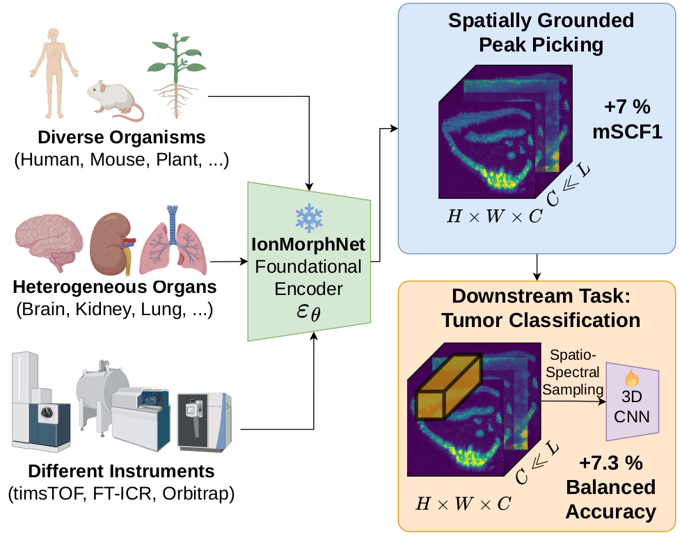

# IonMorphNet: Generalizable Learning of Ion Image Morphologies for Peak Picking in Mass Spectrometry Imaging

[](https://arxiv.org/abs/2604.19369)
[](#citing)
[](https://www.gnu.org/licenses/agpl-3.0)


Official repository of the CVPR 2026 Workshop paper "IonMorphNet: Generalizable Learning of Ion Image Morphologies for Peak Picking in Mass Spectrometry Imaging".

[Philipp Weigand](https://scholar.google.com/citations?user=WBCzjgcAAAAJ&hl=de)*, Niels Nawrot\*, [Nikolas Ebert](https://scholar.google.de/citations?user=CfFwm1sAAAAJ&hl=de), [Carsten Hopf](https://scholar.google.com/citations?user=Q8T-d1MAAAAJ&hl=de&oi=ao) & [Oliver Wasenmüller](https://scholar.google.de/citations?user=GkHxKY8AAAAJ&hl=de) | *Equal Contribution \
**[CeMOS - Research and Transfer Center](https://www.cemos.hs-mannheim.de/ "CeMOS - Research and Transfer Center"), [University of Applied Sciences Mannheim](https://www.english.hs-mannheim.de/the-university.html "University of Applied Sciences Mannheim")**


<div align="center">
  
  <div>&nbsp;</div>    
</div>


## Installation

### 1. Clone this repository

```bash
git clone https://github.com/CeMOS-IS/IonMorphNet.git
cd IonMorphNet
```

### 2. Create and activate a conda environment

```bash
conda create -n ionmorphnet python=3.9.23
conda activate ionmorphnet
```

### 3. Install dependencies and the package

```bash
pip install -r requirements.txt
pip install -e .
```

## Datasets

The package expects MSI datasets in the following structure:

```text
IonMorphNet
└── data
    └── datasets
        ├── <dataset-id-1>
        │   ├── <dataset-id-1>.imzML
        │   └── <dataset-id-1>.ibd
        ├── <dataset-id-2>
        │   ├── <dataset-id-2>.imzML
        │   └── <dataset-id-2>.ibd
        └── ...
```

We provide our created morphology labels for each dataset at this path:

```text
data/labeling/csv/<dataset-id>.csv
```

You can find the corresponding dataset under

```text
https://metaspace2020.org/dataset/<dataset-id>
```

<!-- The training pipeline recursively scans `data/datasets/` for `.imzML` files and looks up the matching label file by dataset stem name in `data/labeling/csv/`. -->

## Training

Run the following command and specify the validation and test split with
`--val_files` and `--test_files`. All remaining files will be used for training. The following split was used for our trainings.

```bash
python -m msianalyzer.training.train_msi_classifier \
  --timm_model "convnextv2_tiny" \
  --val_files "2017-09-25_19h48m56s.imzML,2023-07-04_10h26m22s.imzML,2025-05-20_08h21m56s.imzML,2025-06-18_03h24m09s.imzML,2025-09-24_18h51m29s.imzML" \
  --test_files "2016-10-01_12h21m40s.imzML,2016-10-01_12h27m29s.imzML,2016-10-25_14h30m16s.imzML,2017-03-10_19h59m17s.imzML,2017-03-17_17h20m49s.imzML"
```

## Evaluation

Make sure to provide the mSCF1 evaluation datasets ([GBM](https://clousi.hs-mannheim.de/index.php/s/gnxRf6fXFQ7faFf), [CAC](https://clousi.hs-mannheim.de/index.php/s/ETC4i3j9QpweAJx)) with corresponding segmentation masks in the following folder structure:

```text
├── IonMorphNet
    ├── data
        ├── mSCF1_Evaluation_Datasets
            ├── dataset1
            │   ├── masks
            │   │   ├── file1_mask.npy
            │   │   ├── file2_mask.npy
            │   │   └── ...
            │   ├── file1.imzML
            │   ├── file1.ibd
            │   ├── file2.imzML
            │   ├── file2.ibd
            │   └── ...
            ├── cac
            │   ├── masks
            │   │   ├── 40TopL_mask.npy
            │   │   ├── 40TopL_mask.npy
            │   │   └── ...
            │   ├── 40TopL.imzML
            │   ├── 40TopL.ibd
            │   └── ...
            └── ...
```

To use our trained ConvNeXt-V2-tiny model, download it from [here](https://clousi.hs-mannheim.de/index.php/s/wdHdDxHasM3ATwX) and extract the zip in the ```IonMorphNet/data/models/``` directory. Then run the Peak Picking evaluation:

```text
python -m msianalyzer.evaluate.evaluate_mSCF1_peak_quality \
--run-dir 20260204-164840_convnextv2_tiny \
--informative-classes structured,negative,localized
```

where --run-dir corresponds to the specific model foldername in ```IonMorphNet/data/models/``` that should be used for evaluation. The results will be stored within that folder in `/evaluation_mSCF1/<date-time>/evaluation_results.csv`.


## Application: Classification of all ion images in imzML/ibd file

```text
python -m msianalyzer.evaluate.classify_ion_images \
--run-dir <model_folder_name> \
--imzml-folderpath "/path/to/folder/with/imzML/files"
```

where --run-dir corresponds to the model foldername in ```IonMorphNet/data/models/``` that should be used. The results will be stored within that folder in `/morphology_predictions`. --imzml-folderpath corresponds to the folder that contains the imzML file(s) that should be anaylzed.

## Troubleshooting

No datasets are found. Verify that:

- dataset files are located at `IonMorphNet/data/datasets/<dataset-id>/`
- each dataset directory contains two files:
  - `<dataset-id>.imzML`
  - `<dataset-id>.ibd`
- the file extension is exactly `.imzML` with the correct capitalization
- each dataset has a matching CSV file in `IonMorphNet/data/labeling/csv/`
- the CSV filename exactly matches the dataset name

## Citing

If you use this code in your research, please cite our paper.

```bibtex
@inproceedings{weigand2026ionmorphnet,
  title={IonMorphNet: Generalizable Learning of Ion Image Morphologies for Peak Picking in Mass Spectrometry Imaging},
  author={Weigand, Philipp and Nawrot, Niels and Ebert, Nikolas and Hopf, Carsten and Wasenm{\"u}ller, Oliver},
  booktitle={Proceedings of the IEEE/CVF Conference on Computer Vision and Pattern Recognition},
  pages={6438--6447},
  year={2026}
}
```